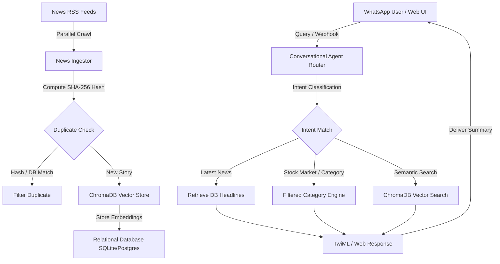
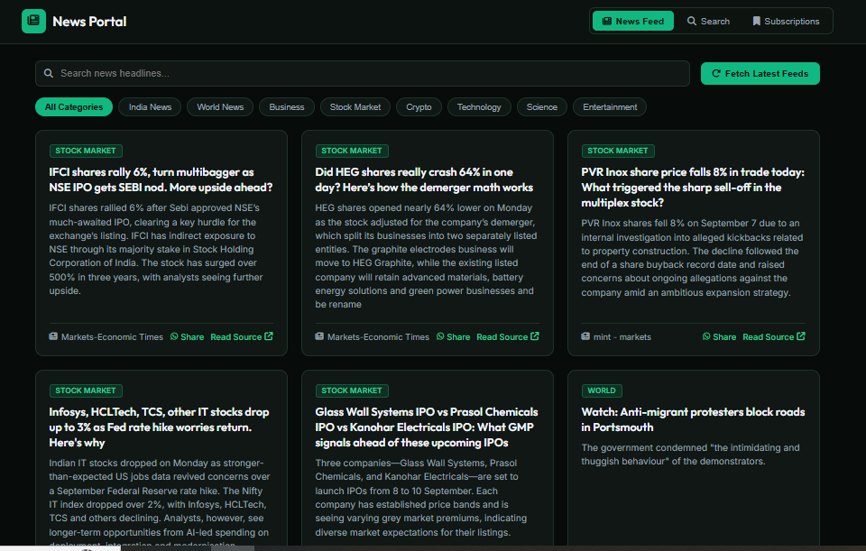
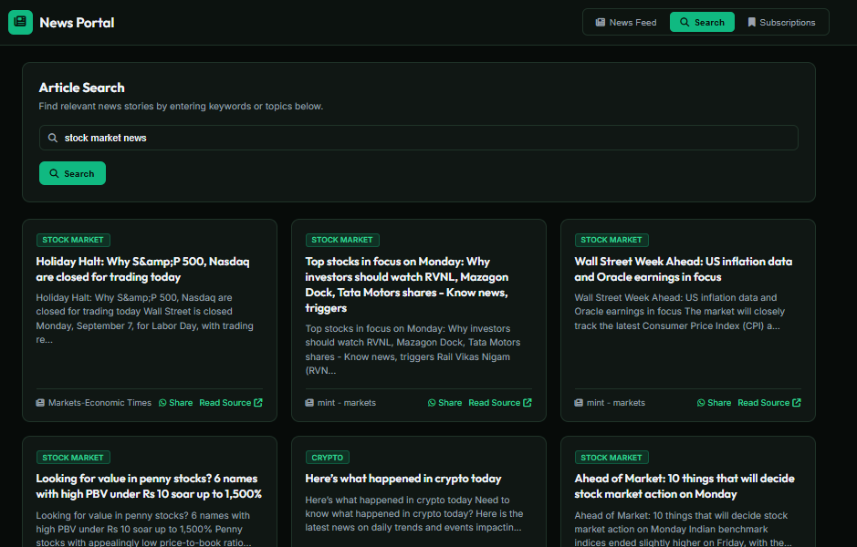
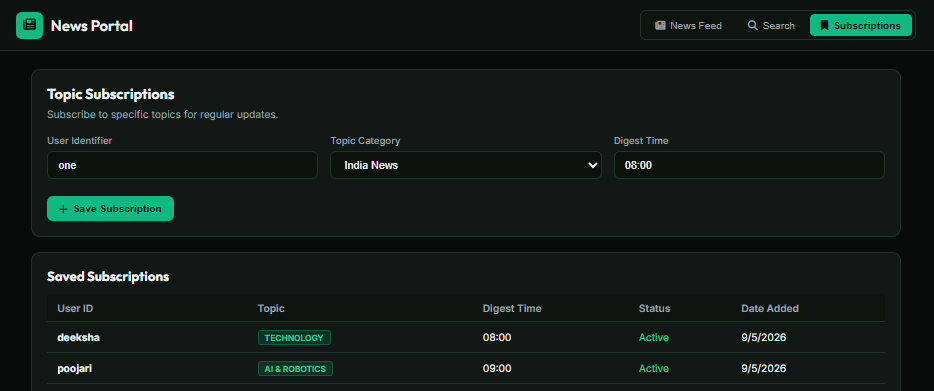
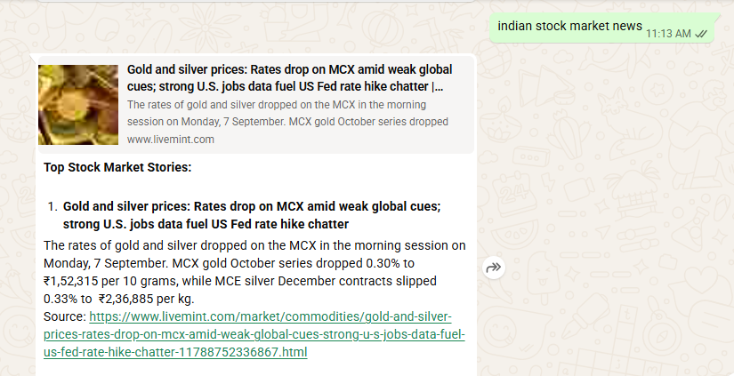
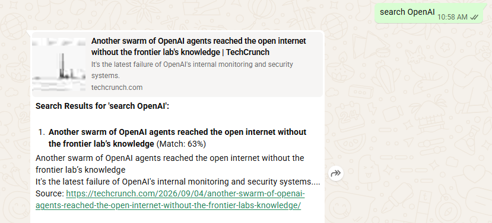
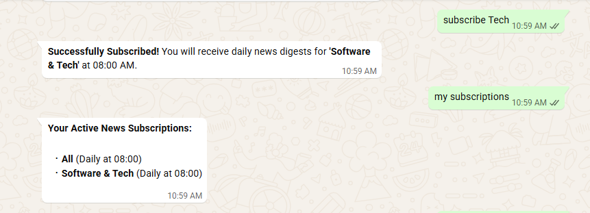

# AI Multi-Agent News Platform & Interactive WhatsApp Webhook Bot


An autonomous multi-agent news intelligence platform that ingests RSS feeds, performs semantic vector deduplication using ChromaDB, serves an interactive Web Dashboard, and delivers real-time personalized news summaries and automated digests over **WhatsApp**.

---

## Key Features

* **Real-Time RSS Ingestion:** Parallel crawling across multi-category news sources (Stock Market, Technology, India News, Crypto, Science, Business) with sub-2-second execution.
* **Vector Semantic Deduplication:** Employs ChromaDB vector storage and OpenAI embeddings (`text-embedding-3-small`) to eliminate duplicate stories across multiple news feeds.
* **WhatsApp Webhook Bot:** Full integration with Twilio and Meta WhatsApp Cloud API supporting intent routing (`Latest News`, `Stock Market`, `Category Filtering`, `Subscriptions`).
* **Interactive Dark-Mode Web Dashboard:** Single Page Application (SPA) featuring live article feeds, instant category filters, and semantic vector search.
* **Automated Topic Subscriptions:** Users can subscribe to topics (e.g. `Stock Market`, `Tech`) to receive automated scheduled WhatsApp digests.
* **Security & Performance:** Pre-cached $O(1)$ memory hash checks, CDATA XML formatting, and character chunking to ensure compliance with messaging constraints.

---

## System Architecture



---

## Application Screenshots & User Interface

### Web UI - News Feed Dashboard

*Single Page Application displaying real-time news articles with category filter pills (Stock Market, Technology, India News, Business, Crypto, Science).*

---

### Web UI - Article Search

*Dedicated Article Search tab allowing users to query stored news articles by topic or keyword.*

---

### Web UI - Topic Subscriptions

*User subscription management interface for scheduling daily automated news digests.*

---

### WhatsApp Webhook - Latest News Query

*Real-time WhatsApp interaction showing automated top news summaries delivered via webhook.*

---

### WhatsApp Webhook - Stock Market Query

*Targeted WhatsApp response for financial queries ("indian stock market news") showing curated market updates.*

---

### WhatsApp Webhook - Semantic Vector Search

*WhatsApp interaction performing vector similarity search over ChromaDB storage for custom queries ("search OpenAI").*

---

### WhatsApp Webhook - Topic Subscriptions

*WhatsApp interaction for subscribing to automated daily topic digests and querying active subscriptions.*

---

## Quick Start & Installation

### 1. Clone & Setup Project

```bash
git clone https://github.com/dpoo61524-cloud/ai-news-whatsapp-bot.git
cd news_agents
```

### 2. Set Up Environment Variables

Copy `.env.example` to `.env`:

```bash
copy .env.example .env
```

Edit `.env` to supply your API credentials:

```env
ENV=development
LOG_LEVEL=INFO

OPENAI_API_KEY=your_openai_api_key_here
EMBEDDING_MODEL=text-embedding-3-small

CHROMA_PERSIST_DIR=./chroma_db
SIMILARITY_THRESHOLD=0.85
DATABASE_URL=sqlite:///./news_agents.db

WHATSAPP_VERIFY_TOKEN=news_agents_verify_token
```

### 3. Create & Activate Virtual Environment

```bash
python -m venv venv
venv\Scripts\activate      # Windows PowerShell / CMD
pip install -r requirements.txt
```

### 4. Run Application Server

```bash
python cli.py serve
```

* **Web UI Dashboard:** Open `http://localhost:8000`
* **Interactive API Docs:** Open `http://localhost:8000/docs`

---

## WhatsApp Setup with Twilio

1. Run an SSH Tunnel to expose your local port `8000`:
   ```bash
   ssh -o StrictHostKeyChecking=no -p 443 -R0:127.0.0.1:8000 a.pinggy.io
   ```
2. Copy the generated `https://...` URL.
3. In **Twilio Console** $\rightarrow$ **Messaging** $\rightarrow$ **WhatsApp Sandbox Settings**:
   * Set **"When a message comes in"** to `https://your-tunnel-url/webhook`
   * Set Method to **HTTP POST**
4. Send **`get latest news`** or **`indian stock market news`** from WhatsApp on your phone!

---

## REST API Reference

| Endpoint | Method | Description |
| :--- | :--- | :--- |
| `/` | `GET` | Serves Frontend Web Dashboard |
| `/webhook` | `GET / POST` | WhatsApp Webhook Verification & Message Handler |
| `/api/ingest` | `POST` | Triggers fast parallel news feed ingestion |
| `/api/articles` | `GET` | Retrieves recent articles from database |
| `/api/search` | `GET` | Executes semantic vector search in ChromaDB |
| `/api/subscriptions` | `GET / POST` | Manage topic subscriptions |
| `/health` | `GET` | Component health check |

---

## Project Directory Structure

```text
news_agents/
├── app/
│   ├── agents/
│   │   ├── conversational.py    # Intent classifier & conversational router
│   │   ├── ingestion.py         # RSS feed parser & hash deduplicator
│   │   ├── vector_store.py      # ChromaDB vector persistence manager
│   │   └── graph.py             # LangGraph workflow pipeline
│   ├── db/                      # Database models and session management
│   ├── services/                # Background scheduler & digest dispatcher
│   ├── config.py                # Pydantic settings loading
│   └── models.py                # API data schemas
├── docs/
│   └── images/                  # Application UI & WhatsApp demo screenshots
├── static/
│   └── index.html               # Single Page Application Web Dashboard
├── cli.py                       # Command line interface tool
├── main.py                      # FastAPI server application entrypoint
├── Dockerfile                   # Docker build definition
└── docker-compose.yml           # Multi-container deployment configuration
```

---

## License

Distributed under the MIT License. See `LICENSE` for details.
